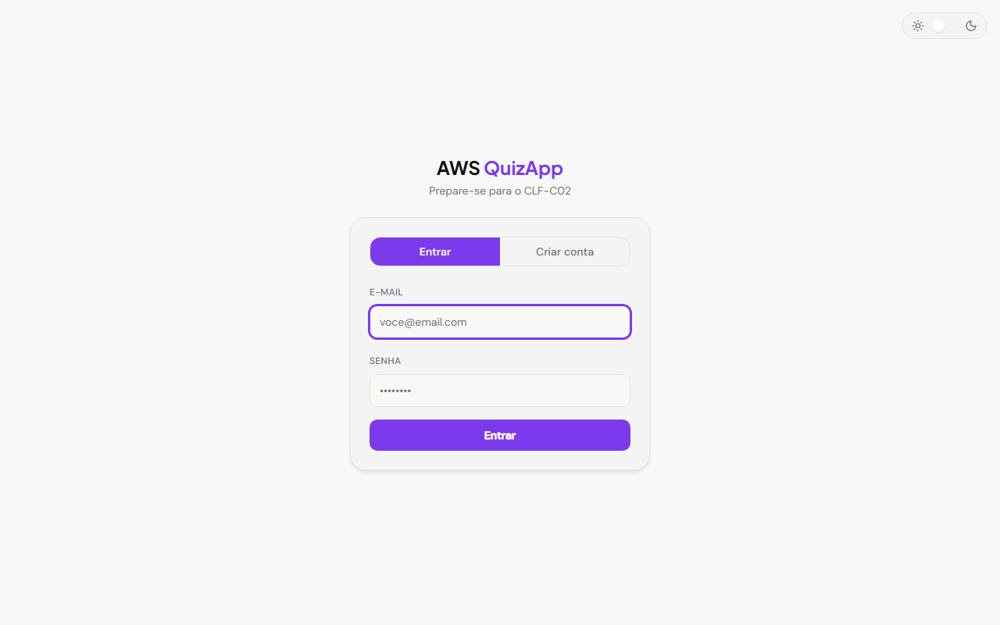
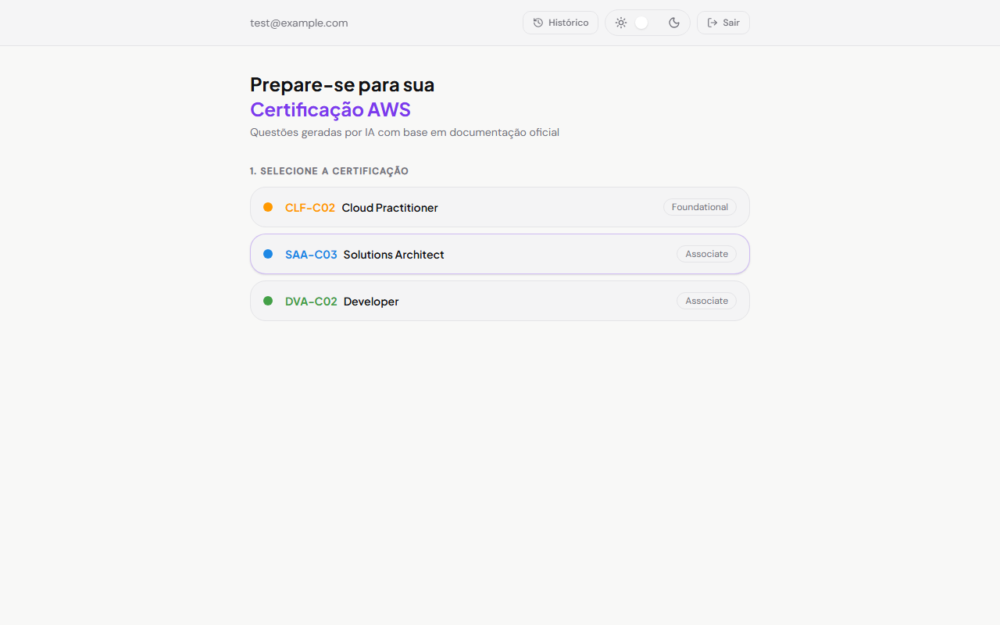
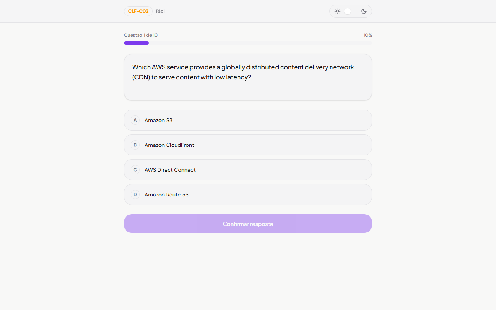
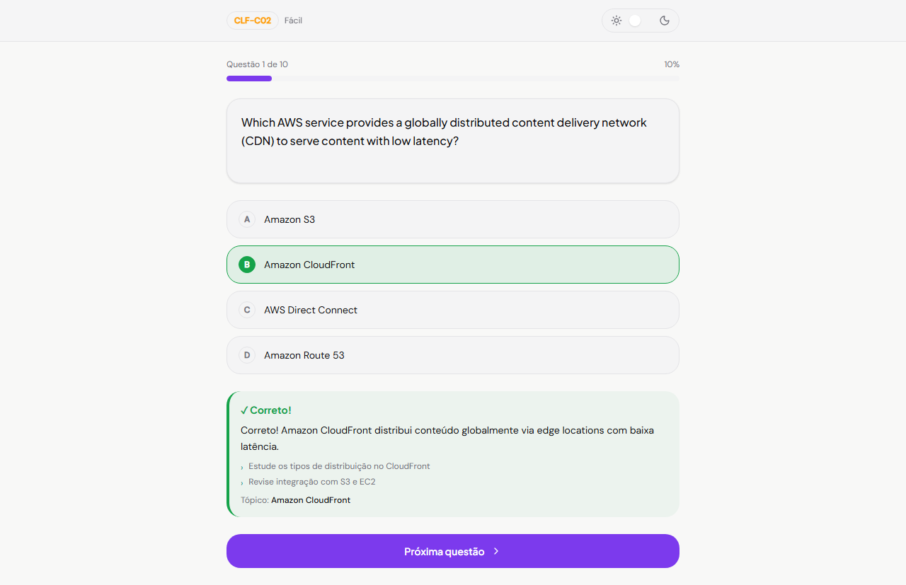
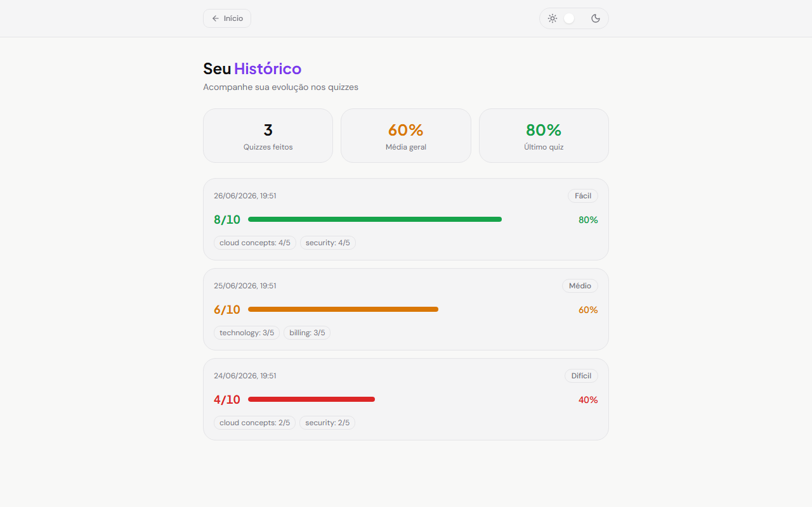
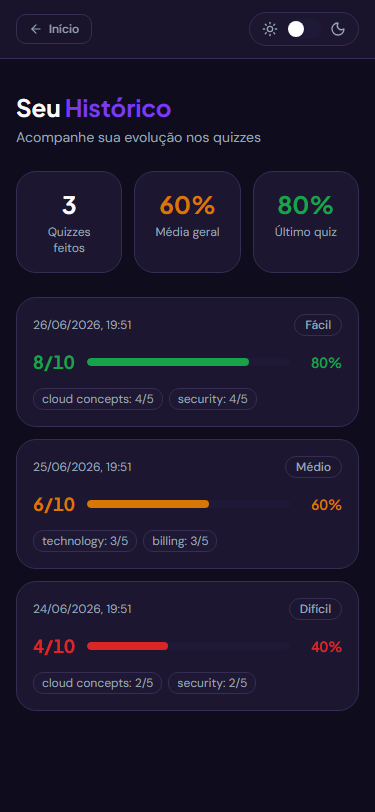

# Certara

Plataforma de preparação para certificações AWS com questões geradas por Inteligência Artificial, feedback personalizado e sistema de assinatura Premium.

**Acesse em produção:** [quizzapp-six-cyan.vercel.app](https://quizzapp-six-cyan.vercel.app)

---

## Telas

### Login


### Home — Seleção de certificação e dificuldade


### Quiz — Questão com progresso


### Feedback da IA após resposta


### Histórico (light e dark mode)



---

## Funcionalidades

### Núcleo
- **3 certificações**: CLF-C02 (Cloud Practitioner), SAA-C03 (Solutions Architect), DVA-C02 (Developer)
- **3 dificuldades**: Fácil, Médio, Difícil
- **10 questões por quiz**, geradas em tempo real pelo Amazon Bedrock
- **Feedback com IA** após cada resposta: explicação, links de estudo e tópico
- **Resumo final** com análise de desempenho e plano de estudo personalizado
- **Histórico completo** com placar, percentual e breakdown por domínio

### UX
- Dark mode com toggle persistente
- Layout responsivo (mobile, tablet, desktop)
- Barra de progresso visual durante o quiz
- Animações suaves (Tailwind Animate)

### Autenticação
- Cadastro e login via **AWS Cognito**
- Rotas protegidas com redirect automático
- Token JWT em todas as chamadas à API

### Assinatura
| | Gratuito | Premium |
|---|---|---|
| Quizzes/dia | 5 | Ilimitados |
| Feedback IA | Sim | Sim |
| Histórico | Últimos quizzes | Completo |
| Preço | R$ 0 | R$ 9,90/mês |

- Checkout via **Stripe** (cartão de crédito)
- Cancelamento com vigência até o fim do período pago
- **Portal do cliente** para trocar cartão e consultar faturas
- Badge de status Premium no header da Home
- Paywall com upgrade prompt quando cota diária é atingida

---

## Stack Técnica

### Frontend
| Tecnologia | Uso |
|---|---|
| React 18 + TypeScript | Framework e tipagem |
| Vite | Build e dev server |
| Tailwind CSS v3 | Estilização (design system "Mente Clara") |
| React Router v6 | Roteamento SPA |
| AWS Amplify v6 | Autenticação Cognito |
| Zustand | Estado global |
| Lucide React | Ícones |

**Deploy:** Vercel (CI/CD automático a partir do branch `main`)

### Backend
| Tecnologia | Uso |
|---|---|
| AWS SAM | Infraestrutura como código (IaC) |
| AWS Lambda (Python 3.11) | 10 funções serverless |
| Amazon API Gateway (HTTP API) | Roteamento com auth JWT |
| Amazon Cognito | Autenticação de usuários |
| Amazon DynamoDB | Banco de dados (histórico + assinaturas) |
| Amazon Bedrock (Nova Pro) | Geração e avaliação de questões com IA |
| Qdrant | Banco vetorial para contexto das questões |
| Stripe | Pagamentos, webhooks e portal do cliente |

**Deploy:** `sam build && sam deploy` (AWS CloudFormation)

---

## Arquitetura

```
┌─────────────────────────────────────────────┐
│               Frontend (Vercel)              │
│  React + TypeScript + Tailwind CSS           │
│  AWS Amplify ──► Cognito (auth)             │
└────────────────────┬────────────────────────┘
                     │ HTTPS + JWT
┌────────────────────▼────────────────────────┐
│          API Gateway (HTTP API)              │
│         Cognito JWT Authorizer              │
└──┬──────┬──────┬──────┬──────┬─────────────┘
   │      │      │      │      │
   ▼      ▼      ▼      ▼      ▼
Lambda  Lambda Lambda Lambda Lambda  ...
gen_q  eval_a  save  hist  sub   (10 funções)
   │      │      │      │      │
   ▼      ▼      ▼      ▼      ▼
Bedrock Bedrock DynamoDB DynamoDB DynamoDB
(Nova) (Nova)  history  history  subscriptions
                              │
                          Stripe API
                              │
                     ┌────────▼────────┐
                     │ stripe_webhook  │
                     │ (sem auth JWT)  │
                     └─────────────────┘
```

---

## Funções Lambda

| Função | Método | Rota | Descrição |
|---|---|---|---|
| `generate_question` | POST | `/generate-question` | Gera questão via Bedrock com verificação de cota |
| `evaluate_answer` | POST | `/evaluate-answer` | Avalia resposta e gera feedback IA |
| `generate_summary` | POST | `/generate-summary` | Gera plano de estudo com base no desempenho |
| `save_quiz` | POST | `/save-quiz` | Salva resultado e incrementa contador diário |
| `list_history` | GET | `/history` | Lista histórico de quizzes do usuário |
| `get_subscription` | GET | `/subscription` | Retorna plano atual e cota diária |
| `create_checkout_session` | POST | `/create-checkout-session` | Cria sessão Stripe Checkout |
| `cancel_subscription` | POST | `/cancel-subscription` | Agenda cancelamento ao fim do período |
| `customer_portal` | POST | `/customer-portal` | Cria sessão do portal de faturamento Stripe |
| `stripe_webhook` | POST | `/stripe-webhook` | Processa eventos Stripe (sem auth JWT) |

### Eventos Stripe monitorados
- `checkout.session.completed` — ativa o plano Premium
- `customer.subscription.updated` — atualiza período de renovação
- `customer.subscription.deleted` — rebaixa para plano Gratuito
- `invoice.payment_failed` — sinaliza falha de pagamento

---

## Estrutura do Projeto

```
quizzapp/
├── src/
│   ├── pages/
│   │   ├── Login.tsx          # Auth (login + cadastro)
│   │   ├── Home.tsx           # Seleção de cert e dificuldade
│   │   ├── Quiz.tsx           # Quiz com 10 questões
│   │   ├── Result.tsx         # Resultado e resumo IA
│   │   ├── History.tsx        # Histórico de quizzes
│   │   └── Subscription.tsx   # Gerenciamento de assinatura
│   ├── components/
│   │   ├── ProtectedRoute.tsx
│   │   ├── ThemeToggle.tsx
│   │   ├── ProgressBar.tsx
│   │   └── SubjectBadge.tsx
│   ├── services/
│   │   ├── api.ts             # Chamadas ao backend
│   │   └── auth.ts            # Helpers Cognito/Amplify
│   ├── types/
│   │   └── quiz.ts            # Tipos TypeScript
│   └── App.tsx                # Rotas
├── backend/
│   ├── template.yaml          # SAM (infraestrutura)
│   ├── samconfig.toml         # Parâmetros de deploy (gitignored)
│   └── functions/
│       ├── generate_question/
│       ├── evaluate_answer/
│       ├── generate_summary/
│       ├── save_quiz/
│       ├── list_history/
│       ├── get_subscription/
│       ├── create_checkout_session/
│       ├── cancel_subscription/
│       ├── customer_portal/
│       └── stripe_webhook/
├── screenshots/               # Prints das telas (gitignored)
└── public/
```

---

## Variáveis de Ambiente

### Frontend (`.env.local`)
```env
VITE_API_URL=https://<api-id>.execute-api.us-east-1.amazonaws.com/prod
VITE_COGNITO_USER_POOL_ID=us-east-1_XXXXXXXXX
VITE_COGNITO_CLIENT_ID=XXXXXXXXXXXXXXXXXXXXXXXXXX
```

### Backend (`backend/samconfig.toml`) — não versionado
```toml
parameter_overrides = [
  "BedrockRegion=us-east-1",
  "BedrockModelId=amazon.nova-pro-v1:0",
  "QdrantUrl=https://...",
  "StripeSecretKey=sk_live_...",
  "StripeWebhookSecret=whsec_...",
  "StripePriceId=price_...",
  "FrontendUrl=https://quizzapp-six-cyan.vercel.app",
]
```

---

## Como rodar localmente

### Frontend
```bash
npm install
npm run dev
```

### Backend
```bash
cd backend
sam build
sam deploy
```

> Após o deploy, copie a `ApiUrl` do output do CloudFormation e coloque em `VITE_API_URL`.

---

## DynamoDB — Estrutura das tabelas

### `quizzapp-history`
| Campo | Tipo | Descrição |
|---|---|---|
| `userId` (PK) | String | ID do usuário Cognito |
| `quizId` (SK) | String | UUID do quiz |
| `score` | Number | Acertos |
| `total` | Number | Total de questões |
| `difficulty` | String | easy / medium / hard |
| `answers` | List | Respostas com domínio e resultado |
| `createdAt` | String | ISO timestamp |

### `quizzapp-subscriptions`
| Campo | Tipo | Descrição |
|---|---|---|
| `userId` (PK) | String | ID do usuário Cognito |
| `sortKey` (SK) | String | `SUBSCRIPTION` ou `QUOTA#YYYY-MM-DD` |
| `plan` | String | `free` ou `premium` |
| `stripeCustomerId` | String | ID do cliente Stripe |
| `stripeSubscriptionId` | String | ID da assinatura Stripe |
| `currentPeriodEnd` | Number | Unix timestamp de expiração |
| `cancelAtPeriodEnd` | Boolean | Cancelamento agendado |
| `quizzesToday` | Number | Contador diário de quizzes |

---

## Segurança

- Chaves Stripe e segredos fora do controle de versão (`samconfig.toml` no `.gitignore`)
- Webhook Stripe validado por assinatura HMAC (`stripe.Webhook.construct_event`)
- Todas as rotas autenticadas por JWT Cognito no API Gateway
- Rota `/stripe-webhook` exposta sem auth JWT (validação via assinatura Stripe)
- Variáveis sensíveis com `NoEcho: true` no SAM template

---

## Planos futuros

- Mais certificações AWS (ANS-C01, SCS-C02, MLS-C01)
- Modo simulado completo (65 questões, tempo)
- Análise de evolução por domínio com gráficos
- Flashcards de revisão gerados por IA
- App mobile (React Native)
